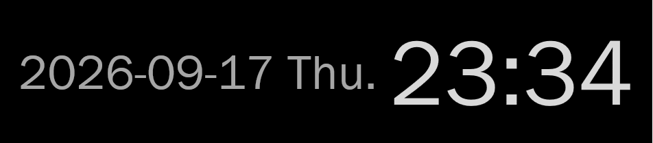
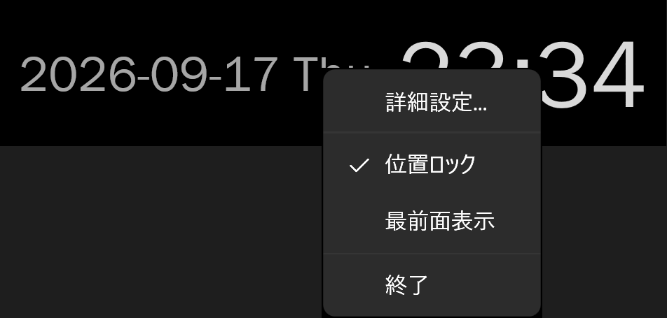
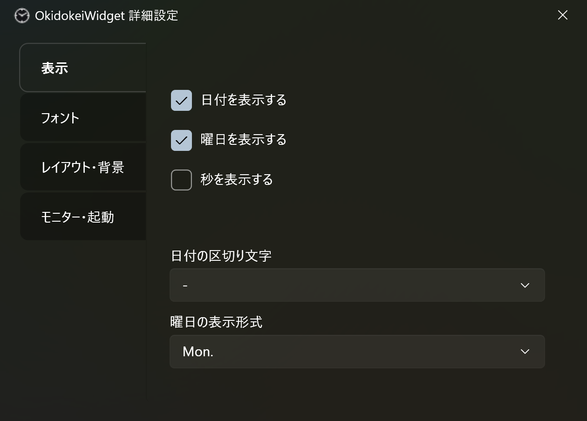

# OkidokeiWidget

Windows 11 上で動作する、常駐型のデスクトップ時計ウィジェットです。

Microsoft Store にある既存のウィジェットで満足できるものがなかったため、個人用に自作しました。

Spec Kit に AI 駆動開発の手法を組み合わせて、仕様・実装計画・タスクを明確にした上で開発しています。

## スクリーンショット

| デスクトップ上のウィジェット | 右クリックメニュー | 詳細設定 |
|---|---|---|
|  |  |  |

## できること

- 時刻・日付・曜日の常時表示
- フォント種類・サイズ・文字色のカスタマイズ
- 背景透過度の調整
- ドラッグでの自由配置、位置ロックによる誤操作防止
  - ドラッグで動かせるのは、表示中のモニタの作業領域 (タスクバーを除いた領域) 内に限ります
- 画面の隅や中央に寄せる配置 (横位置・縦位置・画面端からの余白を右クリックメニューから選択)
  - フォントサイズや表示の拡大率が変わっても、寄せた位置を保ちます
  - 自由配置のときも、余白を選ぶと近くの画面端から離せます
- 常に最前面に表示するかどうかの切り替え
- モニタごとの表示/非表示・表示位置の個別管理(モニタの接続/切断にも追随)
- 右クリックメニューでのクイック切替 + 詳細設定ウィンドウ
- タスクトレイ常駐 + Windows 起動時の自動起動
  - タスクトレイの右クリックメニューからも、ウィジェット本体と同じ操作ができます
- 設定は JSON ファイルで保存 (レジストリは使用しません)

## 使い方

```powershell
dotnet build .\src\OkidokeiWidget.App\OkidokeiWidget.App.csproj -c Release
```

でビルドし、生成された `src/OkidokeiWidget.App/bin/Release/net10.0-windows/OkidokeiWidget.App.exe`
を起動する。ウィジェットを右クリック →「詳細設定」から見た目やモニタごとの表示、自動起動の
ON/OFF を設定できます。

必要環境: Windows 11 / .NET 10 SDK (Windows Desktop ワークロード込み)

## 技術スタック

WPF / C# (.NET 10)。設定は `%APPDATA%` 配下の JSON ファイルに保存します。

## リポジトリ構成

```
docs/
  requirements.md         要件定義書
  screenshots/            README 用のスクリーンショット
.specify/
  memory/constitution.md  プロジェクトの原則 (Spec Kit)
  bugs/                   バグ修正の記録 (Spec Kit の bug 拡張による調査・修正・検証)
specs/
  001-clock-widget/        機能仕様・実装計画・タスク (Spec Kit)
src/
  OkidokeiWidget.App/      WPF アプリ本体
  OkidokeiWidget.Core/     設定・モニタ判定などのロジック
tests/
  OkidokeiWidget.Core.Tests/  OkidokeiWidget.Core の単体テスト
```

## 開発の経緯

[GitHub Spec Kit](https://github.com/github/spec-kit) による AI 駆動開発で、[Claude Code](https://claude.com/claude-code) と組んで作成しました。
`specs/001-clock-widget/` に仕様 (`spec.md`)・実装計画 (`plan.md`)・タスク一覧 (`tasks.md`) がそのまま残っています。

仕様のインプット [docs/requirements.md](docs/requirements.md) (要件定義書) は、[Web の Claude](https://claude.ai/) と相談して作りました。

## License

[MIT](LICENSE)
